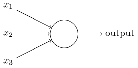

# Using neural nets to recognize handwritten digits

```
two important types of artificial neuron (the perceptron and the sigmoid neuron)

the standard learning algorithm for neural networks, known as stochastic gradient descent

Amongst the payoffs, by the end of the chapter we'll be in position to understand what deep learning is, and why it matters
```

## Perceptrons

A perceptron takes several binary inputs, x1,x2,…, and produces a single binary output：  


Weighted Perceptrons  


